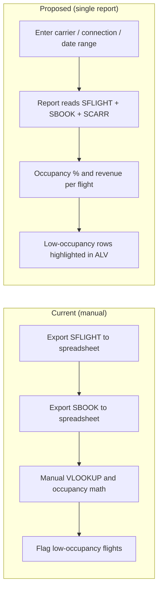

# Software Requirements Specification (SRS)
## [REQ-001] Flight Occupancy and Revenue Analysis Report

> [!NOTE]
> This document defines the business goals and functional requirements.
> **Stage 1 Owner**: Module Analyst / PM

### Document Metadata
- **Requirement ID**: REQ-001
- **Title**: Flight Occupancy and Revenue Analysis Report
- **Primary Analyst**: SD Analyst (booking and revenue data origin)
- **Supporting Analysts (Cross-Module)**: FI Analyst (multi-currency), CO Analyst (profitability view)
- **PM Lead**: PM
- **Status**: DRAFT
- **Last Updated**: 2026-09-25
- **Data Basis**: Live system NPL / client 001, standard Flight Demo Model (SFLIGHT). Verified volumes: 18 carriers (SCARR), 14 connections (SPFLI), 94 flights (SFLIGHT), 27,147 bookings (SBOOK), flight dates 2017-12 through 2019.

---

## 1. Overview & Business Goal

### 1.1 Problem Statement
Flight operations staff cannot see seat occupancy and booking revenue in one view.
Staff currently export SFLIGHT and SBOOK data manually and compute occupancy in spreadsheets.
Manual computation delays low-occupancy detection and produces inconsistent revenue figures.
The demo data confirms wide occupancy spread: flight AA 0017 on 2017-12-19 filled 371 of 385 seats (96.4 %), while the same connection on 2018-11-04 filled 44 of 385 seats (11.4 %).

### 1.2 Business Objective
Provide one read-only ABAP report that lists seat occupancy and booking revenue per flight.
Success is measured by: (a) operations staff run the report daily, (b) low-occupancy flights are visible without manual calculation, (c) revenue figures match the source tables exactly.

### 1.3 Scope of Change
- **In Scope**:
  - Read-only ALV Grid report over the standard Flight Demo Model tables (SFLIGHT, SPFLI, SCARR, SBOOK, SAIRPORT).
  - Selection screen filters: carrier, connection, flight date range, booking class.
  - Per-flight seat occupancy rate with low-occupancy highlighting.
  - Per-flight booking counts by class (F / C / Y) from SBOOK.
  - Per-flight revenue in the carrier currency (SCARR.CURRCODE) with carrier subtotals.
  - Standard ALV layout variants and spreadsheet export.
- **Out of Scope**:
  - Any write access to SBOOK, SFLIGHT, or related tables (no booking creation or cancellation).
  - Currency conversion to a group currency (separate FI requirement).
  - Fiori / web UI (classic ALV report only).
  - New authorization objects (use standard table authorizations).

---

## 2. Business Process & User Roles

### 2.1 User Personas & Roles
- **Flight Operations Analyst**: Runs the report daily. Filters by carrier and date range. Flags flights with low occupancy for schedule review. Exports results for the weekly review meeting.
- **Revenue Controller (CO)**: Reviews revenue figures per carrier. Cross-checks booking class distribution.

### 2.2 Current vs. Proposed Process Flow

---

## 3. Functional Requirements

> [!TIP]
> Assign a unique, traceable ID to each requirement and use Gherkin-style scenarios for complex business rules.

### 3.1 Selection and Data Retrieval

#### **REQ-001-F01**: Selection Screen
- **Description**: The report provides a selection screen with carrier (SCARRID, optional), connection (SCONNID, optional), flight date range (SFLDATE, mandatory pair), and booking class (SCLASS, optional, values F / C / Y).
- **Gherkin Scenario**:
  - **Given**: The user starts the report.
  - **When**: The user enters carrier `AA`, date range `2018-01-01` to `2018-12-31`, and executes.
  - **Then**: The system lists every SFLIGHT row for carrier AA inside the date range, and no rows outside it.

#### **REQ-001-F02**: Seat Occupancy Rate
- **Description**: The report shows SEATSOCC and SEATSMAX per flight. The report computes occupancy as SEATSOCC / SEATSMAX × 100 with one decimal place. The report highlights rows with occupancy below 70 % in red.
- **Gherkin Scenario**:
  - **Given**: Flight AA 0017 on 2018-11-04 holds SEATSMAX 385 and SEATSOCC 44.
  - **When**: The report lists this flight.
  - **Then**: The occupancy column shows `11.4 %` and the row is highlighted.

#### **REQ-001-F03**: Booking Counts per Class
- **Description**: For each flight in the result, the report counts SBOOK rows per class (F / C / Y) and shows three columns. The report reads SBOOK with the key fields CARRID, CONNID, FLDATE only.

#### **REQ-001-F04**: Revenue per Flight
- **Description**: The report computes revenue per flight as SFLIGHT.PRICE × SFLIGHT.SEATSOCC. The report displays the amount in the carrier currency from SCARR.CURRCODE (verified values: AA → USD, LH → EUR, JL → JPY). The report shows a subtotal per carrier at the end of each carrier block.

#### **REQ-001-F05**: City Pair Description
- **Description**: For each connection, the report shows the city pair from SPFLI joined to SAIRPORT (departure and arrival airport names).

### 3.2 Output and Usability

#### **REQ-001-F06**: ALV Output
- **Description**: The report outputs an ALV Grid. The user can sort, filter, and save layout variants. The user can export the result to a spreadsheet with the standard ALV export.

---

## 4. Non-Functional Requirements

#### **REQ-001-NF01**: Performance
- **Criteria**: A full-data run (94 flights, 27,147 bookings) completes in under 3 seconds. The report accesses SBOOK only through its primary key prefix (CARRID, CONNID, FLDATE).

#### **REQ-001-NF02**: Security & Compliance
- **Criteria**: The report performs read-only table access. The report runs under standard table authorizations (S_TABU_DIS). The report holds no write statements.

#### **REQ-001-NF03**: Maintainability
- **Criteria**: All thresholds (the 70 % occupancy limit) are constants in one place. No hardcoded carrier or connection values exist in the logic.

---

## 5. Handoff to Technical Group

### 5.1 Cross-Module & Business Checklists
- [x] Primary Analyst verified table relationships: SBOOK → SFLIGHT on (CARRID, CONNID, FLDATE); SFLIGHT → SCARR on CARRID (currency origin); SPFLI → SAIRPORT on AIRPFROM / AIRPTO.
- [x] Data volumes verified by live query on 2026-09-25 (see Data Basis in metadata).
- [x] No hardcoded values in requirements; the occupancy threshold is a named constant.
- [ ] FI Analyst to confirm: revenue display stays in carrier currency without conversion (pending sign-off).
- [ ] CO Analyst to confirm: class-level booking counts satisfy the profitability view (pending sign-off).

### 5.2 Sign-off & Handoff
- **Authoring Analyst Signature**: ___________________ (Date: 2026-09-25)
- **PM Governance Approval**: ___________________ (Date: _________)
- **Technical Lead Acceptance**: ___________________ (Date: _________)
