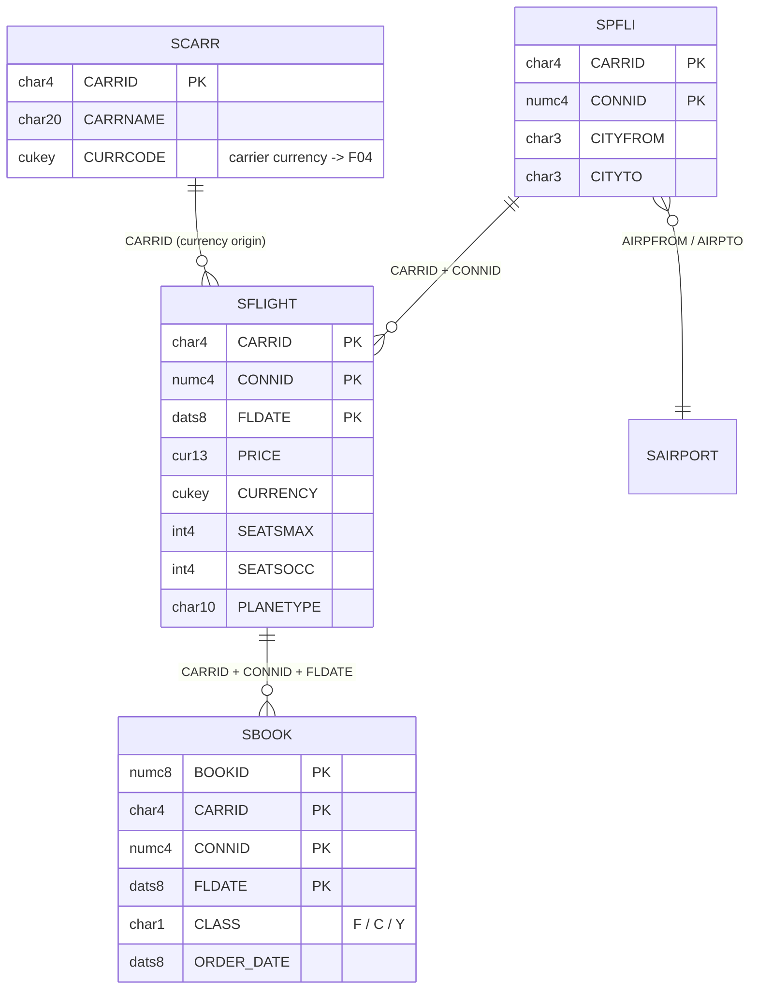
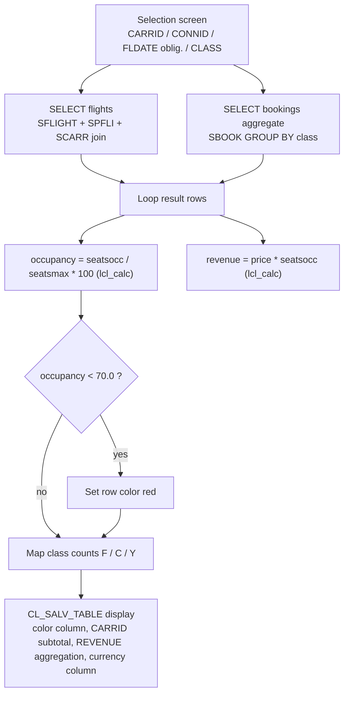

# Technical Design — [REQ-001] Flight Occupancy and Revenue Analysis Report

> **Stage 2 Owner**: Architect & DBA
> **Basis**: `01_srs.md` (Stage 1, DRAFT → assumed approved for design)
> **Last Updated**: 2026-09-25

## 1. Pattern Selection

| Option | Description | Verdict |
| :--- | :--- | :--- |
| A — Classic report + REUSE_ALV_* | Function-module ALV, procedural | Rejected: legacy function ALV, poor testability |
| **B — Report + local calculation class + CL_SALV_TABLE** | Executable report; pure calculation logic in a local class covered by ABAP Unit; SALV object model for output | **Selected** |
| C — CDS view + Fiori Elements | Analytical modeling layer + UI5 front end | Rejected for scope: SRS restricts to a classic ALV report; no UI5 runtime target stated |

Pattern B satisfies REQ-001-NF03 (one place for the threshold constant) and enables the mandatory QA chain (unit tests + coverage) without extra objects.

## 2. Object List

| Object | Type | Package | Transport | Change |
| :--- | :--- | :--- | :--- | :--- |
| `ZFLIGHT_OCC_REVENUE` | PROG (executable report) | `$TMP` | local (none) | NEW |

`$TMP` (local) is used because the target system is the NPL demo instance and the SFR is analytics on demo data. Promotion to a productive system re-creates the object in a customer namespace package with a CTS request (no code change required).

## 3. Data Model (as-used)

Access paths (DBA review):
- SFLIGHT read once with the two JOINs above; WHERE covers leading key fields (CARRID, CONNID, FLDATE) via SELECT-OPTIONS — index-aligned per REQ-001-NF01.
- SBOOK read in **one** aggregate SELECT (`GROUP BY CARRID, CONNID, FLDATE, CLASS`) instead of per-flight queries; primary-key prefix matches the WHERE clause.

## 4. Program Control Flow

## 5. Internal Structure

| Unit | Kind | Responsibility | Test |
| :--- | :--- | :--- | :--- |
| `LCL_CALC=>OCCUPANCY_RATE` | static method | SEATSOCC / SEATSMAX × 100, 1 decimal; SEATSMAX ≤ 0 → 0 | `LCL_TEST` (ABAP Unit, 4 cases incl. SRS example 44/385 → 11.4) |
| `LCL_CALC=>REVENUE` | static method | PRICE × SEATSOCC | `LCL_TEST` |
| `LCL_CALC=>GC_LOW_OCC` | constant | 70.0 — the single threshold required by REQ-001-NF03 | — |
| `LCL_REPORT=>BUILD` | instance method | both SELECTs, class-count mapping, row coloring | covered indirectly |
| `LCL_REPORT=>DISPLAY` | instance method | SALV factory, color column, sort/subtotal, aggregation, currency column, standard functions, layout key | manual (UI) |

Numeric note: the occupancy division runs through a float intermediate so the result does not depend on the program's fixed-point arithmetic attribute; assignment to `P DECIMALS 1` rounds half-up (44/385 → 11.4 exactly as quoted in the SRS Gherkin).

## 6. Risks & Notes

- Selection texts ship as technical names unless maintained in text elements (accepted for the demo scope; listed in implementation report).
- `SFLIGHT.CURRENCY` also exists and equals `SCARR.CURRCODE` for all demo rows; the design follows the SRS and displays the carrier currency, with the flight currency column shown as-is.
- Layout variants are enabled with report key `ZFLIGHT_OCC_REVENUE` (REQ-001-F06).
