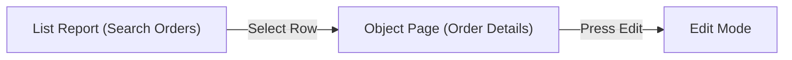

# Technical Design Document - Fiori / UI5 Frontend
## [REQ-NNN] [Requirement Title]

> [!NOTE]
> This document defines the UX/UI floorplans, component hierarchy, controller bindings, and client-side logic.
> **Stage 2 Owner**: Fiori Developer (fiori-developer) / UX Designer

### Document Metadata
- **UX/UI Design Lead**: [Fiori Developer]
- **Associated SRS**: [REQ-NNN: 01_srs.md](../01_srs.md)
- **Status**: DRAFT | REVIEW | APPROVED
- **Last Updated**: YYYY-MM-DD

---

## 1. UX / UI Specification

### 1.1 Fiori Floorplan Selection
- **Floorplan Chosen**: [e.g., Worklist / List Report / Object Page / Flexible Column Layout / Custom Freestyle]
- **Rationale**: [Describe why this floorplan was selected based on user needs]

### 1.2 Target Personas & Navigation
- **Persona**: [e.g., Sales Manager]
- **Entry Point / Tile**: [e.g., Fiori Launchpad Group "Sales", Tile "Manage Sales Invoices"]
- **Navigation Flow**:

---

## 2. Component & UI Architecture

### 2.1 View & Controller Hierarchy
[Describe the view hierarchy and controller responsibilities.]
- `App.view.xml` (Root View)
  - `Main.view.xml` (Search and List view)
  - `Detail.view.xml` (Detail and edit view)

### 2.2 Model & Data Binding
- **Primary OData Service**: `/sap/opu/odata/sap/ZADT_NNN_SRV/`
- **Entity Set Bindings**:
  - Main Table: `/SalesOrderSet` (Binding mode: OneWay / TwoWay)
  - Details Form: `/SalesOrderSet('{vbeln}')`

---

## 3. UI5 Control Layout & Custom Extensions

### 3.1 Naming Conventions & Control IDs
- Table Control ID: `salesOrderTable`
- Search Field Control ID: `salesOrderSearchField`

### 3.2 Mock Data & Extension Points
- **Mock JSON Path**: `webapp/localService/mockdata/SalesOrderSet.json`
- **Custom Controls / Fragments**: [Describe any custom UI5 controls or reusable XML fragments used]

---

## 4. Implementation Plan & Handoff

### 4.1 UI5 Tech Stack & Version
- **UI5 Version**: SAPUI5 v1.96 / v1.108
- **UI5 Tooling**: SAP Fiori Tools / UI5 CLI
- **Language**: JavaScript / TypeScript

### 4.2 Webapp Directory File Changes List

| File Relative Path | File Type | Action | Description |
| :--- | :--- | :--- | :--- |
| `webapp/manifest.json` | JSON | Modify | Register new route, target, and i18n models. |
| `webapp/view/Main.view.xml` | XML | Modify | Add search table and buttons. |
| `webapp/controller/Main.controller.js` | JS | Modify | Implement row selection and search filters. |

### 4.3 Developer Handoff Checklist
- [ ] Figma/Axure UI mockups are reviewed and attached.
- [ ] OData Metadata and Entity Sets are validated and active.
- [ ] Custom CSS or icons are approved and documented.

---

## 5. Backend Service & RAP Design

> Tool names follow [vsp Tool Reference (Hyperfocused Mode)](../../docs/co-abap.context.md#vsp-tool-reference-hyperfocused-mode); naming follows [DA-8](../../docs/co-abap.context.md#da-8-custom-cds-naming-vdm-aligned).

### 5.1 OData Version Choice
- **Protocol**: OData V4 (default for new RAP/Fiori Elements) / OData V2 (justify: e.g. legacy SEGW service, UI5 < 1.84, offline or V2-only floorplan)
- **Rationale**: [...]

### 5.2 RAP Artifacts

| Artifact | Name | Details |
| :--- | :--- | :--- |
| Root view entity | `ZR_<Entity>` | Data source: [...] |
| Projection view | `ZC_<Entity>` | Scenario: [...] |
| Metadata extension (DDLX) | `ZC_<Entity>` | UI annotations (5.3) |
| Behavior definition (BDEF) | `ZR_<Entity>` / `ZC_<Entity>` | managed / unmanaged / managed with unmanaged save; draft yes/no; ETag field; numbering |
| Behavior pool | `ZBP_R_<Entity>` | validations, determinations, actions |
| Service definition (SRVD) | `ZUI_<Entity>` | exposed entities |
| Service binding (SRVB) | `ZUI_<Entity>_O4` | publish step (local publish is a GUI/ADT step; record who and when) |

### 5.3 Fiori Elements Annotations (in DDLX)
- `@UI.headerInfo`: [typeName / title]
- `@UI.lineItem`: [fields, positions, importance]
- `@UI.selectionField`: [filter bar fields]
- `@UI.facet`: [Object Page sections / field groups]
- `@UI.identification` / actions: [...]
- Value helps (`@Consumption.valueHelpDefinition`): [...]

### 5.4 Authorization
- **DCL** per [DA-5](../../docs/co-abap.context.md#da-5-cds-authorization): `@AccessControl.authorizationCheck: #CHECK` on `ZR_`/`ZC_`; DCLS `[name]`, authorization object `[...]`
- **Instance / global authorization in BDEF**: [...]
- **Launchpad**: business catalog / role `[...]`

### 5.5 Accessibility
- Target: **WCAG 2.1 Level AA**, verified with the `accessibility-audit` skill (keyboard navigation, contrast, screen-reader labels on custom controls). Findings: [...]

### 5.6 Clean Core / Released APIs (C1)

| Used object (I_* view, class, BAdI) | Release state (C1) | Verified in ADT by / date |
| :--- | :--- | :--- |
| `[I_...]` | Released / Not released / `C1 not verified` | [...] |

> No vsp tool reads API release state in v2.60.0; verify manually per [DA-3](../../docs/co-abap.context.md#da-3-priority-order-when-in-scope).

### 5.7 Feature-Flag Prerequisites
- [ ] UI5 repository read/deploy needs `SAP_FEATURE_UI5=on` (off by default) - otherwise read the app from Git/BAS export.
- [ ] RAP deploy tools need `SAP_FEATURE_RAP=on` (off) - otherwise create artifacts via `create`/`edit` (R2) or in ADT.
- [ ] Any flag change is a `.mcp.json` change approved by the PM; unlocked deploy tools are R3.
